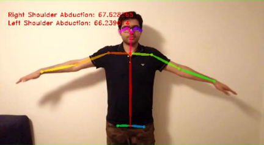
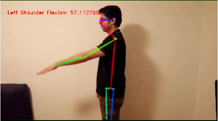
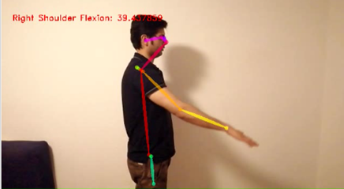
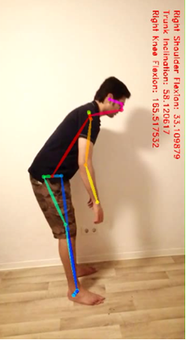

# OpenPoseAPI
In this project the OpenPose API is used by using C++. The Human motion is captured by a Mobile camera. The OpenPose repository is extracting from https://github.com/CMU-Perceptual-Computing-Lab/openpose.git. 
The human skeleton is detected and extracting 2D points of the human skeletons in "Image Co-ordinates". The co-ordinates are further used for the joint angle calculations. I integrated this API with JointName(), JointAxes and JointAngle() functions which could calculate the angle between the body joints e.g: Shoulder Flexion, Shoulder Abduction, Trunk Inclination and Knee Flexion. The detected joint points and body angles futher save into .csv files. 
The following enviroment is used to build the OpenPose API.
- Visual Studio 2017
- OpenCV 4.2.0 https://github.com/opencv/opencv.git
# Build OpenPose
The following steps are used to build the OpenPose.
- The extracting OpenPose repository is build by using CMake
- After successfully build, Goto the "build Folder" and open OpenPose.sln
- "Solution Explorer" is on the right side of the Visual Studio window. Click on "Examples", then "Tuturial" and then "C++ API".
- In "C++ API", there are severals example. This projects use "03_keypoints_from_image". Right click on the "03_keypoints_from_image" and made it "Set as Startup Project".
# Results
- Extracts the Joint Point with its coresponding Joint Name and save it into .csv file
- Calculate the Joint Angles and save these angles into .csv file

 

 

 

 
